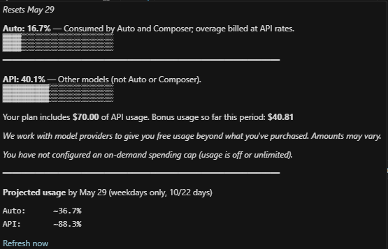

# Cursor Spending

View your **Cursor** usage in the status bar and a detailed hover tooltip: Auto, API, optional **on-demand** cap usage, billing period context, and straight-line projections.



## Features

- **Status bar** – **Auto** and **API** percentages (codicons). If you have a **finite on-demand spend cap** configured, a third segment **`$: %`** shows how much of that cap you have used. Click the segment to open the [dashboard Spending tab](https://cursor.com/dashboard?tab=spending).
- **Rich tooltip** – Progress bars (Auto / API / on-demand when applicable), short explanations, plan **included API allowance** (`limit`), optional **bonus spend** and **bonusTooltip**, on-demand messaging when no individual cap is returned, **billing reset** line when cycle dates are known (or from settings fallback).
- **Projection** – Linear extrapolation to end of billing period (`allDays` or **weekdays only**), with optional **100% crossing** hints. Projection block is monospace for alignment.
- **Diagnostics** – Each successful fetch appends the **full JSON** response to the **Output** channel **Cursor Spending** (useful if Cursor changes fields).

## Requirements

- **VS Code** or **Cursor** `^1.85.0`
- A Cursor account and session cookie value for `WorkosCursorSessionToken`

## Installation

### Marketplace

1. Extensions (`Ctrl+Shift+X` / `Cmd+Shift+X`).
2. Search **Cursor Spending**.
3. Install.

### VSIX (local build)

```bash
npm install && npm run compile
npx @vscode/vsce package
```

Then **Install from VSIX…** and select the generated `.vsix`.

## Quick start

1. Sign in at [cursor.com/dashboard](https://cursor.com/dashboard).
2. DevTools → **Application** → **Cookies** → `cursor.com` → copy **`WorkosCursorSessionToken`** value.
3. Settings → search **Cursor Spending** → paste **Session Token**, or click the status item when empty to open the token panel.

## Extension settings

| Setting | Description | Default |
|--------|-------------|---------|
| `cursorSpending.sessionToken` | `WorkosCursorSessionToken` cookie value. | `""` |
| `cursorSpending.refreshInterval` | Fetch interval (minutes). | `20` (1–1440) |
| `cursorSpending.billingCycleDay` | Day of month (1–31) billing resets if API omits `billingCycleStart` / `End`. `0` = API only. | `0` |
| `cursorSpending.projectionMode` | `allDays` or `weekdaysOnly` for projection day counts. | `allDays` |

## Commands

| Command | Description |
|--------|-------------|
| **Cursor Spending: Refresh usage** | Fetch now. |
| **Cursor Spending: Configure session token** | Open token setup webview. |

## API reference

The extension calls **`POST https://cursor.com/api/dashboard/get-current-period-usage`**.  
A field-by-field reference (with a sample payload) lives in **[docs/api-get-current-period-usage.md](docs/api-get-current-period-usage.md)**. That endpoint is **undocumented** and may change.

## Security and privacy

- Token is stored in **global** user settings; do not commit or share it.
- Only that Cursor URL is called, with your token in the `Cookie` header.
- **Output** logging writes the **response body** (not your token) on each successful fetch; clear the channel if you prefer not to retain history.

## Development

- `npm install` && `npm run compile`
- Use **Run and Debug** → **Run Extension** (see `.vscode/launch.json`), or configure **F5** to run that launch config so the Extension Development Host loads **this** workspace’s `out/extension.js`.
- **Developer: Reload Window** in the host after recompiling.

## License

MIT
